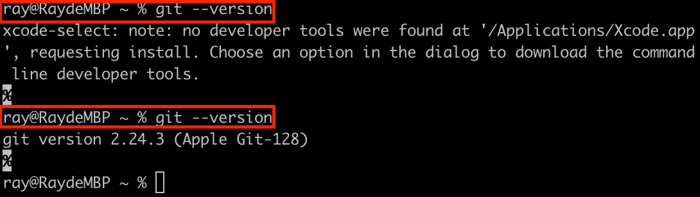
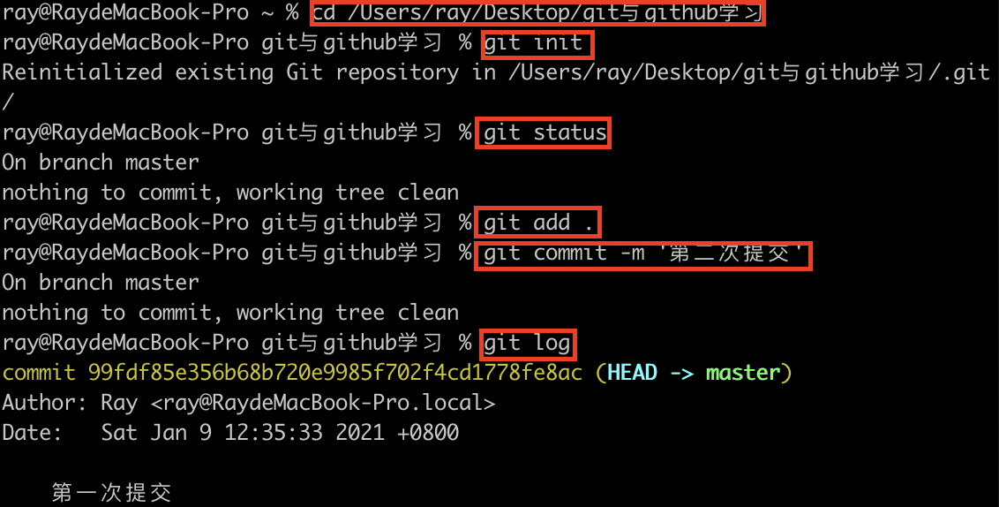
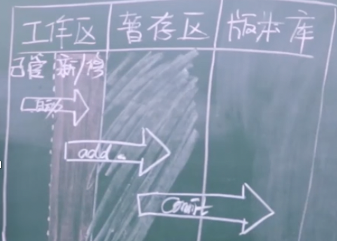
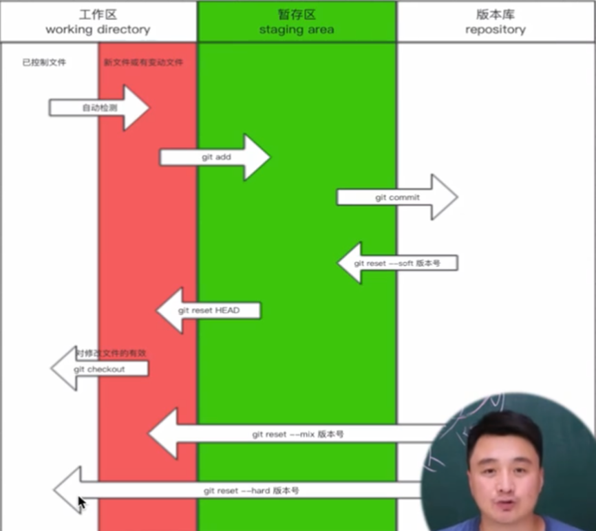

## Git和Github学习
### 一、Git简介
Git是分布式版本控制的软件【多文件的文件拷贝->单文件的本地版本控制->集中化的版本控制（中央服务器，比如SVN）->分布式的版本控制】
### 二、版本控制
版本控制是指对软件开发过程中各种程序代码、配置文件及说明文档等文件变更的管理，是软件配置管理的核心思想之一。
### 三、安装Git
参考Git官网学习如何[安装Git](https://git-scm.com/book/zh/v2/%E8%B5%B7%E6%AD%A5-%E5%AE%89%E8%A3%85-Git)

我使用的是macOS系统，在iTerm上输入`git --version`，系统将自动安装命令行工具，再次输入`git --version`检查安装的本地版本。 
### 四、使用Git进行版本控制
下图为将尚未进行版本控制的本地目录转换为Git仓库的流程

1. 初始化仓库
   ```cd 文件路径```
2. 执行初始化命令
   ```git init```
3. 目录下的文件状态
   ```git status```
4. 管理文件
   ```git add 文件名/.```
5. 个人信息配置
   ```git config --global user.email "用户邮箱"```
   ```git config --global user.name "用户名"```
6. 生成版本
   ```git commut -m '描述信息'```
7. 查看版本记录
   ```git log```
### 五、Git的三大区域
- 工作区
已经管理的文件->新增的/修改的（自动）
- 暂存区
把文件提交到暂存区
   ```git add 文件名/.```
- 版本库
把文件提交到版本库
   ```git commit -m '描述信息'```

下图为Git的三大区域


### 六、回滚
- 查看版本记录
   ```git log```
- 回滚至之前版本
   ```git reset --hard 版本号```
- 回滚后查看所有版本
   ```git reflog```
- 再次回滚
   ```git reset --hard 版本号```
- 从**工作区的新文件或变动文件**回滚至**已控制文件**
   ```git checkout -文件名```
- 从**暂存区**回滚至**工作区的新文件或变动文件**
   ```git reset HEAD 文件名```

下图为三个工作区提交和回滚的命令
### 七、分支
分支可以给使用者提供多个环境，意味着可以把工作环境从开发主线上分离开来，以免影响开发主线，创建新的分支可用于修改bug

- 查看分支
   ```git branch```
- 创建分支
   ```git branch 分支名```
- 切换分支
   ```git checkout 分支名```
- 合并分支（可能产生冲突）
   ```git merge 分支名```
- 删除分支
   ```git branch -d 分支名```
### 八、github
1. 注册账号
2. 创建仓库
3. 将本地代码推送至远程仓库

- 给远程仓库起别名
   ```git remote add origin 远程仓库地址```
- 像远程仓库推送代码
   ```git push -u origin 分支名```
- 克隆远程仓库代码
   ```git clone 远程仓库地址```