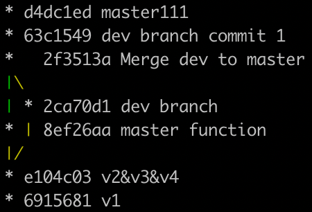

## Git和Github学习
### 以下学习笔记参考[7小时学会Git 基础全套完整教程（从入门到精通）](https://www.bilibili.com/video/BV1tf4y1e7yt?p=1)
### 一、Git简介
Git是分布式版本控制的软件【多文件的文件拷贝->单文件的本地版本控制->集中化的版本控制（中央服务器，比如SVN）->分布式的版本控制】
### 二、版本控制
版本控制是指对软件开发过程中各种程序代码、配置文件及说明文档等文件变更的管理，是软件配置管理的核心思想之一。
### 三、安装Git
参考Git官网学习如何[安装Git](https://git-scm.com/book)

我使用的是macOS系统，在iTerm上输入`git --version`，系统将自动安装命令行工具，再次输入`git --version`检查安装的本地版本。 
### 四、使用Git进行版本控制
下图为将尚未进行版本控制的本地目录转换为Git仓库的流程

1. 初始化仓库
   ```cd 文件路径```
2. 执行初始化命令
   ```git init```
3. 目录下的文件状态
   ```git status```
4. 管理文件
   ```git add 文件名/.```
5. 个人信息配置
   ```git config --global user.email "用户邮箱"```
   ```git config --global user.name "用户名"```
6. 生成版本
   ```git commut -m '描述信息'```
7. 查看版本记录
   ```git log```
### 五、Git的三大区域
- 工作区
已经管理的文件->新增的/修改的（自动）
- 暂存区
把文件提交到暂存区
   ```git add 文件名/.```
- 版本库
把文件提交到版本库
   ```git commit -m '描述信息'```

下图为Git的三大区域


### 六、回滚
- 查看版本记录
   ```git log```
- 回滚至之前版本
   ```git reset --hard 版本号```
- 回滚后查看所有版本
   ```git reflog```
- 再次回滚
   ```git reset --hard 版本号```
- 从**工作区的新文件或变动文件**回滚至**已控制文件**
   ```git checkout -文件名```
- 从**暂存区**回滚至**工作区的新文件或变动文件**
   ```git reset HEAD 文件名```

下图为三个工作区提交和回滚的命令
### 七、分支
分支可以给使用者提供多个环境，意味着可以把工作环境从开发主线上分离开来，以免影响开发主线，创建新的分支可用于修改bug

- 查看分支
   ```git branch```
- 创建分支
   ```git branch 分支名```
- 切换分支
   ```git checkout 分支名```
- 合并分支（可能产生冲突）
   ```git merge 分支名```
- 删除分支
   ```git branch -d 分支名```
### 八、github
1. 注册账号
2. 创建仓库
3. 将本地代码推送至远程仓库

- 给远程仓库起别名
   ```git remote add origin 远程仓库地址```
- 像远程仓库推送代码
   ```git push -u origin 分支名```
- 克隆远程仓库代码
   ```git clone 远程仓库地址```
- 从远程仓库拉代码
   ```git pull origin 分支名```等同于`git fetch origin 分支名`（从远程仓库拉到版本库）加上`git merge origin/dev`（从版本库拉到工作区）
### 九、rebase应用场景
#### (一) 多个记录合并成一个记录
`git rebase -i HEAD~数字`
注：合并记录时不要和已经push到仓库的文件rebase
#### (二) 将分支并为主线
1. 方法一
详见第七章合并分支，先切换到master分支，再merge
2. 方法二
使用`git rebase master`，再将dev分支merge
   下图为使用rebase命令后的记录
#### (三) 合并后不产生分叉
在公司开发的未上传，回家后再开发，又回公司后使用`git fetch origin dev`和`git rebase origin/dev`而代替`git pull origin dev`
### 十、快速解决冲突
1. 安装beyond compare
2. 在git中配置
`git config --local merge.tool bc3`
`git config --local mergetool.path '/usr/local/bin/bcomp'`
`git config --local mergetool.keepBackup false`
3. 应用beyond compare解决冲突
`git mergetool`
### 十一、命令总结
- 添加远程连接（别名）
`git remote add origin 地址`
- 推送代码
`git push origin 分支`
- 下载代码
`git clone 地址`
- 拉代码
`git pull origin dev`等价于`git fetch origin dev`和`git merge origin/dev`
- 保持代码提交整洁（变基）
`git rebase 分支`
- 记录的图形展示
`git log –graph –pretty=format:"%h %s"`
### 十二、多人协同之创建初始项目
1. 创建仓库
2. 邀请协作者
   方法一（在新建的仓库中邀请协作者）
   `settings`->`Manage access`->`invite a collaborator`
   方法二（创建组织邀请协作者）
   1）创建组织
   2）邀请成员
   3）传到本地
   4）推送远端
   5）打上标签
   `git tag -a v1 -m '第一版'`
### 十三、多人协同之邀请成员
1. 创建dev分支
2. 邀请协作者
### 十四、多人协同之邀请成员参与开发
1. 在项目中添加协作者
   `settings`->`Collaborators`
2. 通过`git clone`命令拉代码到协作者本地
3. 在dev分支上创建新的分支
4. 开发
5. 通过`git push`命令上传到远程
### 十五、多人协同之代码review
1. 配置
`settings`->`Branches`->`Add rule`->`Branch name pattern`->`Rule settings: require pull request reviews before merging`
2. 提交New Pull Request
1）选中合并的分支
2） 标题和正文
3. 代码检查
1）进入request
2) `Add your review`
3) merge pull request
4. 拉到本地
### 十六、多人协同之测试上线
1. 创建release分支
2. 测试人员提交pull request
3. merge pull request
4. dev分支合并删除release分支
5. 从远程拉代码
6. 添加标签
7. 推送远程
`git push origin --tags`
### 十七、给开源项目贡献代码
1. fork源代码
将别人的源代码拷贝到我自己的远程仓库
2. 在自己的仓库修改代码
3. 给源代码的作者提交修复bug的申请(pull request)
### 十八、其他
（一）配置
- 项目配置文件：项目/.git/config
`git config --local user.name '姓名'`
`git config --local user.email '邮箱'`
- 全局配置文件：～/.gitconfig
`git config --global user.name '姓名'`
`git config --global user.email '邮箱'`
- 系统配置文件：/etc/.gitconfig
`git config --system user.name '姓名'`
`git config --system user.email '邮箱'`
 注意：需要有root权限
应用场景
`git config --local user.name '姓名'`
`git config --local user.email '邮箱'`
`git config --local merge.tool bc3`
`git config --local mergetool.path '/usr/local/bin/bcomp'`
`git config --local mergetool.keepBackup false`
默认添加在本地配置文件中`git remote add origin 地址`

（二）git免密登陆
- URL中体现
原来的地址->修改的地址`https://用户名:密码@网址`
git remote add origin `https://用户名:密码@网址`
git push origin master
- SSH实现
1. 生成公钥和私钥(默认放在 ～/.ssh目录下，id_rsa.pub公钥、id_rsa私钥）
`ssh-keygen`
2. 拷贝公钥的内容，并设置在github中
3. 在git本地配置SSH地址
`git remote add origin SSH地址`
4. 以后使用
`git push origin master`
- git自动管理凭证
钥匙串访问

（三）git忽略文件
让git不再管理当前目录下的某些文件，输入`vim .gitignore`，在里面写上需要忽略的文件名

- *.h
- a.h
- !a.h
- files/
- *.py[c|a|b]
- [更多参考](https://github.com/github/gitignore)

（四）任务管理相关
- issues，文档以及任务管理
- wiki，项目文档说明